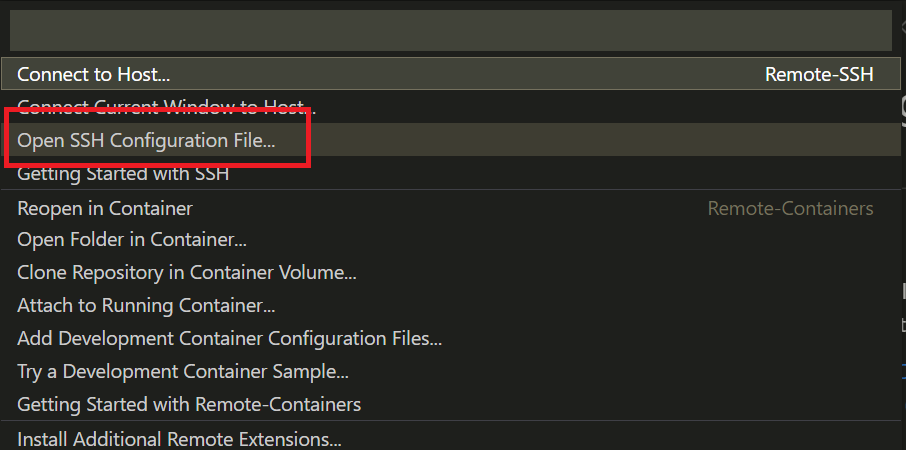

# Connecting with Visual Studio Code

## Requirements
In order to successfully work on the VM, you will need `VS Code` and the following extension
- [Visual Studio Code](https://code.visualstudio.com/)
- [Remote - SSH (extension)](https://marketplace.visualstudio.com/items?itemName=ms-vscode-remote.remote-ssh)


## Downloading the Extension
If you have Visual Studio Code, navigate to the Extensions tab on the left docked menu.
Shortcut: `(SHIFT+COMMAND+X) or (⇧⌘X)` on Mac and `(CTRL+SHIFT+X)` on Windows.

1. Search for `ms-vscode-remote.remote-ssh`
2. Click on `Install`

<br>

## Setup config - PrivateKey
After installing the extension, on your local directory:
1. Navigate to `~/.ssh` and create a new file
```bash
touch privatekey
```
2. Open and paste in the PrivateKey certificate saved earlier from `generated_ssh_private_key` 
3. Run the following to secure the key

```bash
chmod 400 privatekey
```

> NOTE: the filename can be any name

<br>

## Setup config - SSH Config
1. Navigate to bottom-left corner of `Visual Studio Code` and click on the button to `Open a Remote Window`. The following popup should appear,



2. Select `Open SSH Configuration File`
and select the first option (usually `~/.ssh/config`).


3. Add a new entry or replace the current template with their respective values
    ```
    Host <CONFIGNAME>
        HostName <WORKVM_PUBLIC_IP>
        User opc
        IdentityFile <PRIVATEKEY_FILE_LOCATION>
    ```

    - __CONFIGNAME__ can be any value. (e.g. `WORKVM`)
    - __PRIVATEKEY_FILE_LOCATION__ from the [Setup Config - Private Key step](#setup-config---privatekey) step (e.g. `~/.ssh/privatekey`)
    - __WORKVM_PUBLIC_IP__ is the IP address saved earlier from `workvm_public_ip`

4. Save the entry


## Connect
1. Click on the button to `Open a Remote Window` again and select `Connect to Host`
2. Select the __CONFIGNAME__ you provided.


# More Resources
- [Remote Development using SSH](https://code.visualstudio.com/docs/remote/ssh)
