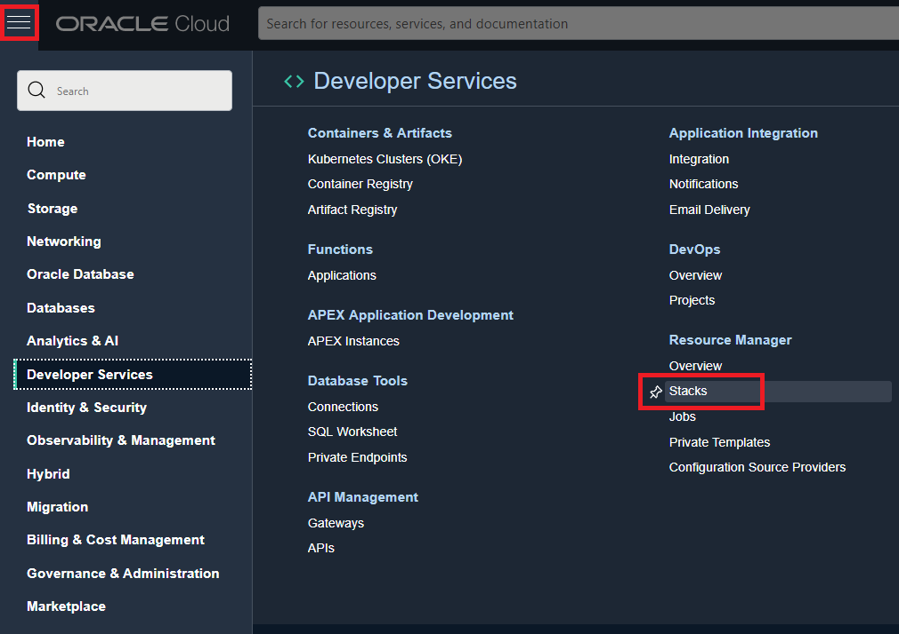
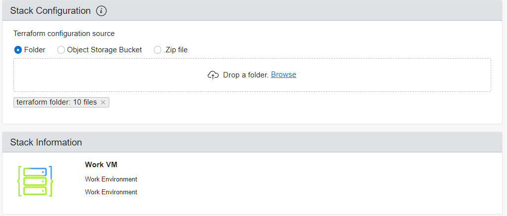
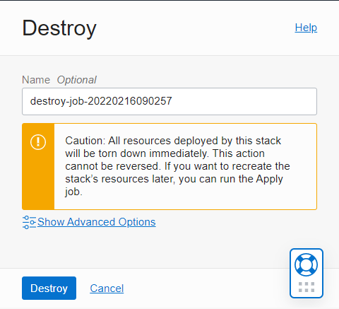

# Provisioning with Oracle Resource Manager (ORM)
To provision a work VM via ORM, console access and policies to create Networks and a Compute VM are _required_. The following link will allow you to directly import this project to ORM.

[](https://cloud.oracle.com/resourcemanager/stacks/create?region=home&zipUrl=https://github.com/naberin/oracle.remote.dev/releases/download/v1.0.2/terraform.zip)

If you click the option above to `Deploy to Oracle Cloud`, skip to [Step 3 of Create a New Stack](#create-a-new-stack).

<br>

## Get Started
Clone the repository and `cd` into the directory
```
https://github.com/naberin/oracle.remote.dev.git && cd oracle.remote.dev
```

## Navigate To ORM
On your Oracle Cloud console, open the top menu by clicking the hamburger-icon.
Navigate to `Developer Services` > Resource Manager > Stacks




## Create a New Stack
1. Select the compartment on the left under __List Scope__ and click on __Create Stack__
2. Upload the `terraform` folder in your local repository and select [Upload] if/when prompted. Uploading the folder should have the following output on the console.



3. Click `Next`.
4. Under `Required Configuration`, select the compartment to provision the files in.
5. Click `Next` and confirm the details.
6. Click `Create`.

## Plan and Apply The Stack
At the top, the following
1. Click on `Plan` to ensure and confirm all resources that will be created. A new job will be created. If the plan job succeeds, proceed to Apply.
2. Click on `Apply` and the following side-menu.

## Completion
Upon successful completion of the job, you will see an option on the left to view the `Job Resources` created as well as `Outputs`.
1. Copy and Save `generated_ssh_private_key`
2. Copy and Save `workvm_public_ip`

Proceed to next step, [connecting to the Work VM](./connection.md).

<br>

# Cleaning Up
When you are done with the work VM, simply return to `Resource Manager > Stack` and select your stack.
1. Click the red button, `Destroy` and the following side-menu on the right should appear.



3. Select `Destroy`.
4. Select `Delete Stack` under `More Actions` if the stack will no longer be needed in the future.
